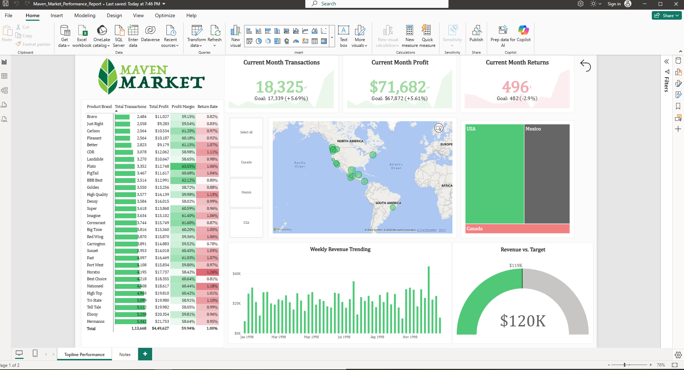

# North American Retail Sales & Performance Dashboard

## Executive Overview
This interactive Power BI report provides high-level executive insights and operational performance tracking for a multi-regional retail operation across North America. It monitors monthly revenue trends, return rates, and profit margins against defined business goals.



---

## Key Features & Business Insights
* **KPI Metrics Tracking:** Real-time visibility into Current Month Transactions, Profit, and Returns versus month-over-month target goals.
* **Geographic & Regional Analysis:** Interactive map and slicers to isolate sales concentration across the USA, Mexico, and Canada.
* **Bookmark-Driven Navigation:** Integrated an executive "Notes to Business" menu page using Power BI Bookmarks to jump directly to pre-filtered outlier trends.
* **Product Performance:** Conditional formatting and inline bar charts to surface high-return and low-margin product brands instantly.

---

## Technical Stack & Architecture
* **Tooling:** Power BI Desktop, Power Query, DAX
* **Data Modeling:** Implemented a **Star Schema** architecture connecting central Fact tables (*Sales*, *Returns*) with Dimension tables (*Products*, *Customers*, *Stores*, *Regions*).
* **Data Transformation:** Cleaned, transformed, and unpivoted raw data tables using **Power Query**.

### Sample DAX Measures
```dax
// Current Month Profit Measure
Current Month Profit = 
CALCULATE(
    [Total Profit],
    DATESMTD('Calendar'[Date])
)

// Total Returns Rate
Return Rate = 
DIVIDE(
    [Total Returns], 
    [Total Transactions], 
    0
)
```
```
├── Maven_Market_Performance_Report.pbix  # Power BI Project File
├── README.md                             # Project Documentation
└── images/                               # Dashboard Screenshots
```
